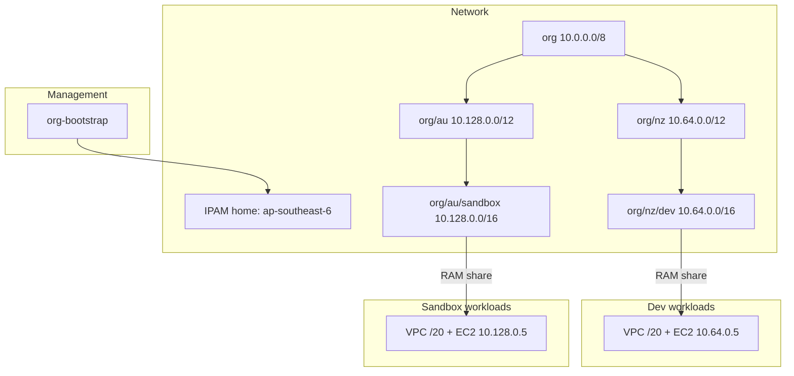
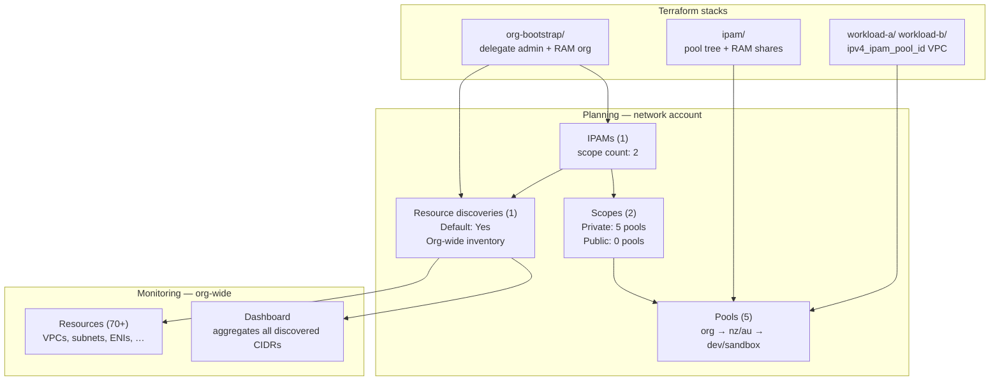
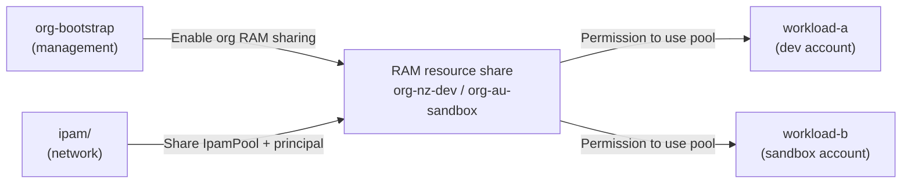

# Multi-Account IPAM Walkthrough

Canonical design rationale and reference for the `examples/multi-account/` example.

Operational commands: [`examples/multi-account/README.md`](../../../examples/multi-account/README.md).  
Empirical errors from applies: [`examples/multi-account/FINDINGS.md`](../../../examples/multi-account/FINDINGS.md).  
Console layout and diagram seeds: [IPAM console map](#ipam-console-map-diagram-friendly).

## Story

ANZ enterprise pattern on a four-account AWS Organization:

- **NZ-primary dev** (ap-southeast-6) — data sovereignty, low latency for NZ users
- **Sydney sandbox** (ap-southeast-2) — AU hub, integration testing, cross-region DR
- **Dedicated network account** hosts org-wide IPAM; management account delegates admin and enables RAM org sharing
- **Regional pools** enforce locale: a NZ pool CIDR cannot allocate a VPC in Sydney

## Architecture



RAM share grants **permission** to use a pool. **IPAM allocation** (linking the VPC CIDR to the pool) is what makes usage visible in the network account — see [Workload onboarding and IPAM visibility](#workload-onboarding-and-ipam-visibility).

## Overview and success criteria

This walkthrough describes a complete multi-account IPAM flow:

1. Delegate IPAM admin and enable RAM org sharing in the management account
2. Create IPAM and regional/account pools in the network account
3. Create workload VPCs from shared pools in each workload account
4. Verify both formal pool allocations and org-wide resource discovery

The deployment is considered successful when all of the following are true:

- `org/nz/dev` and `org/au/sandbox` exist with expected CIDRs and locales
- Leaf pools are RAM-shared to the intended workload accounts
- Workload VPCs are created with `ipv4_ipam_pool_id` and appear as **Managed**
- Pool **Allocations** shows `/20` allocations owned by workload accounts
- **Monitoring → Resources → ENIs** shows expected host IPs (`10.64.0.5`, `10.128.0.5`)

## Glossary

| Term | Meaning in this walkthrough |
| --- | --- |
| **IPAM** | Amazon VPC IP Address Manager instance in the network account |
| **Scope** | Default IPAM scope (`Private` for RFC1918, `Public` for BYOIP/public IPv4) |
| **Pool** | CIDR container in IPAM; nested as org → region → account |
| **Locale** | Region constraint for a pool (`ap-southeast-6` / `ap-southeast-2`) |
| **RAM share** | Permission for another account to use an IPAM pool via AWS Resource Access Manager |
| **Resource share** | RAM object linking an `ec2:IpamPool` to a principal account (`org-nz-dev`, `org-au-sandbox`) |
| **Allocation** | Formal CIDR assignment from pool to resource (for example a VPC `/20`) |
| **Managed CIDR** | CIDR on a manageable resource allocated from an IPAM pool |
| **Resource discovery** | Org-wide inventory process for VPCs/subnets/ENIs/EIPs |
| **Operating regions** | Regions enabled on the IPAM instance; derived from pool locales plus home region |
| **Discovered resource** | Any VPC/subnet/EIP/public IPv4 pool found by org resource discovery — may or may not use an IPAM pool |
| **Private scope (dashboard)** | Default RFC1918 scope; Monitoring aggregates **all** discovered private CIDRs in the org, not only pools defined in Terraform |
| **% Available / Allocated / Assigned** | Pool utilization columns: free space / child pool or formal allocation / resource usage (VPC) respectively |

## Decision log

| Decision | Our choice | Type | Rationale | Verify |
| --- | --- | --- | --- | --- |
| IPAM admin account | Network member account | AWS + design | Management account cannot host IPAM; dedicated network ownership | [Integrate IPAM with Org](https://docs.aws.amazon.com/vpc/latest/ipam/enable-integ-ipam.html) |
| Stack count | 4 Terraform roots | Design | Credential boundary per account; RAM enable only in mgmt | README apply order |
| IPAM home region | ap-southeast-6 | Design | NZ-primary workloads; home = where IPAM resource is created | `terraform -chdir=ipam output operating_regions` |
| Operating regions | ap-southeast-6 + ap-southeast-2 | Derived | Pool locales + home region | Same output |
| Pool hierarchy | org → nz/au → dev/sandbox | Design | Regional aggregation; room for sibling pools under `/12` | Console IPAM pools |
| Root pool locale | None on `org` | AWS constraint | Parent with locale locks all children to that region | [Multi-region IPAM blog](https://aws.amazon.com/blogs/networking-and-content-delivery/managing-ip-pools-across-vpcs-and-regions-using-amazon-vpc-ip-address-manager/) |
| IPAM scope | Private only (`scope_type` default) | AWS + design | AWS creates Private and Public default scopes per IPAM; RFC1918 VPC pools use Private; Public stays empty | Console scope dropdown → **Private** |
| CIDR plan | `/8` → `/12` regional → `/16` account → `/20` VPC | Design | Non-overlapping, recognisable blocks | Pool CIDRs in `ipam/main.tf` |
| Workload regions | dev=ap-southeast-6, sandbox=ap-southeast-2 | Design | Locale enforcement | `aws sts get-caller-identity` per profile |
| RAM org sharing | `org-bootstrap/` (mgmt) | AWS constraint | Member accounts get `AccessDeniedException from AWSOrganizations`; pools cannot be shared without org RAM | FINDINGS.md; RAM → Resource shares |
| NAT gateway | disabled | Design | ~$0/day idle VPC cost; not IPAM-related | `enable_nat_gateway = false` in workload |
| Example compute | 1× t3.nano, subnet `/32` reservation + `private_ip` | Design | `.5` at subnet/ENI layer; visible centrally via IPAM **Resources → ENIs** | IPAM Monitoring → Resources → subnet → ENIs |
| Profiles | ipam-org, ipam-network, ipam-workload-a/b | Design | One profile per account | README credentials table |
| Workload VPC CIDR | `ipv4_ipam_pool_id` on `aws_vpc` | AWS best practice | Formal pool allocation; IPAM shows **Managed** VPC | Network IPAM → pool → **Allocations** |
| Monitoring scope | Org-wide discovery (all member accounts) | AWS behavior | Pool tree in `ipam/main.tf` does not filter discovery | Monitoring → Resources resource count >> pool count |

## Pools vs monitoring (what `ipam/main.tf` controls)

The pool hierarchy in `examples/multi-account/ipam/main.tf` defines **address planning and allocation**. It does **not** define what appears in **Monitoring → Dashboard** or **Monitoring → Resources**.

```hcl
# ipam/main.tf — planning only
pools = {
  org = { cidr = ["10.0.0.0/8"], sub_pools = { ... } }
}
```

That configuration creates five pools under the **Private** scope (`org`, `org/nz`, `org/nz/dev`, `org/au`, `org/au/sandbox`). It does **not** tell IPAM to ignore VPCs, subnets, or accounts outside those pools.

### Two separate planes

| Plane | Where in console | Driven by | Shows |
| --- | --- | --- | --- |
| **Planning** | Planning → IPAMs, Scopes, Pools, Resource discoveries | `ipam/` stack + workload `ipv4_ipam_pool_id` | IPAM instance, scopes, pool hierarchy, formal allocations |
| **Monitoring** | Monitoring → Dashboard, Resources | Org integration (`org-bootstrap/`) + default resource discovery | **Every** discovered VPC, subnet, ENI, EIP, public IPv4 pool in org member accounts |

### IPAM console map (diagram-friendly)

Use this map when building illustrations. Two top-level areas — **Planning** (what Terraform defines) and **Monitoring** (what org discovery inventories).



| Console page | Typical count (this deployment) | Terraform / AWS source | Scope of data |
| --- | --- | --- | --- |
| **Planning → IPAMs** | 1 | `module.ipam` → `aws_vpc_ipam` | Single IPAM in network account; home region `ap-southeast-6` |
| **Planning → Scopes** | 2 (Private + Public) | Auto-created with IPAM | **Private:** all `10.x` pools. **Public:** empty (unused) |
| **Planning → Pools** | 5 | `ipam/main.tf` pool tree | Only pools defined in Terraform — not all org VPCs |
| **Planning → Resource discoveries** | 1 (Default) | Auto-created with IPAM + org delegation | Discovery engine for Monitoring — **org-wide**, not pool-filtered |
| **Monitoring → Dashboard** | 1 scope view | Resource discovery + CloudWatch | Aggregates **all** discovered private CIDRs in org |
| **Monitoring → Resources** | 70+ rows typical | Resource discovery | Every discovered VPC/subnet/ENI across member accounts |

Always select **Private** scope in the scope dropdown when viewing pools or the dashboard for this example.

#### Planning → IPAMs

After `ipam/` apply, expect **one** IPAM in the network account:

| Field | Expected value |
| --- | --- |
| State | `Create-complete` |
| Scope count | **2** (Private + Public — both auto-created) |
| Home region | `ap-southeast-6` |
| Operating regions | `ap-southeast-6`, `ap-southeast-2` (from pool locales + home) |

Terraform output: `terraform -chdir=examples/multi-account/ipam output ipam_id`

#### Planning → Scopes

AWS always creates two default scopes per IPAM. This example uses **Private** only.

| Scope | Type | Default | Pool count | This example |
| --- | --- | --- | --- | --- |
| Private (`ipam-scope-…`) | Private | Yes | **5** | All `org` / `org/nz` / `org/au` / leaf pools |
| Public (`ipam-scope-…`) | Public | Yes | **0** | Empty — no BYOIP/public IPv4 pools |

The **Public** scope is normal and costs nothing while empty. All pool work and RAM shares for this example are under **Private**.

#### Planning → Pools

The pool table shows the hierarchy from `ipam/main.tf`. Expect **five** pools nested under the Private scope:

| Pool path | Description | Locale | CIDR |
| --- | --- | --- | --- |
| `org` | Org-wide super-pool (global container) | — | `10.0.0.0/8` |
| `org/nz` | NZ regional aggregate | `ap-southeast-6` | `10.64.0.0/12` |
| `org/nz/dev` | NZ dev pool (RAM → workload-a) | `ap-southeast-6` | `10.64.0.0/16` |
| `org/au` | AU regional aggregate | `ap-southeast-2` | `10.128.0.0/12` |
| `org/au/sandbox` | AU sandbox pool (RAM → workload-b) | `ap-southeast-2` | `10.128.0.0/16` |

**Pool utilization columns** (console):

| Column | Meaning | Example after workload apply |
| --- | --- | --- |
| **% Available** | CIDR space not yet allocated to child pools or resources | High at every level (most of `/8` still free) |
| **% Allocated** | Space given to **child pools** or formal pool allocations | Root shows ~12.5% (regional `/12`s from `/8`); leaf pools often **0%** |
| **% Assigned** | Space in use by **resources** (VPCs, etc.) | Leaf pools show ~**2.99%** after `/20` VPC create (`/16` → one `/20` ≈ 3%) |

A leaf pool can show **0% Allocated** and **~3% Assigned** simultaneously — **Assigned** is the workload VPC CIDR; **Allocated** at that level tracks child-pool splits (leaf pools have no children).

Open a leaf pool → **Allocations** tab for the formal `/20` → VPC link (owner = workload account). Open **Resource shares** for RAM principals.

#### Planning → Resource discoveries

Expect **one** default resource discovery (auto-created with the IPAM):

| Field | Expected value |
| --- | --- |
| Default | **Yes** |
| State | `Create-complete` |
| Owner | Network account ID |

AWS describes resource discovery as controlling which networking resources are discovered. With **org integration** enabled (`org-bootstrap/`), discovery monitors **all organization member accounts** — not only accounts with RAM-shared pools and not only CIDRs inside `10.0.0.0/8`.

Resource discovery feeds **Monitoring → Dashboard** and **Monitoring → Resources**. It does **not** replace or narrow the **Planning → Pools** view. Pool count stays **5** regardless of how many VPCs exist in the org.

Check **Last successful discovery time** on the discovery detail page when Monitoring data looks stale.

### What monitoring includes (beyond this example)

In a typical org, **Monitoring → Resources** lists far more than the two workload VPCs from this example. Expect to see:

| Resource type | Example in console | Relation to this example |
| --- | --- | --- |
| **IPAM pool CIDR** | `10.0.0.0/8`, `10.64.0.0/12`, … | Created by `ipam/` — **Planning** |
| **VPC (Managed)** | `10.64.0.0/20`, `10.128.0.0/20` with pool allocation | Created by workload stacks with `ipv4_ipam_pool_id` |
| **VPC (Unmanaged)** | Legacy VPCs (`dev-internal`, `prod-internal`, `10.1.0.0/16`, …) | Pre-existing in member accounts; discovered, not pool-backed |
| **VPC (Overlapping)** | Default VPCs `172.31.0.0/16` in multiple accounts/regions | One per account/region; same CIDR → **Overlapping** status |
| **Subnet** | One row per subnet under each VPC | Majority of **Resource CIDR types** count (often 70+ subnets vs ~16 manageable VPC CIDRs) |

A resource count of **70–75** on the Resources page with only **five IPAM pools** is normal: most rows are subnets and VPCs discovered org-wide, not pool definitions from Terraform.

### Reading the monitoring dashboard widgets

Scope: **Default private scope** (same scope as the `10.x` pools). Widgets still aggregate **org-wide discovered** CIDRs, not “pools we defined only.”

| Widget | What it counts | Typical contents in a multi-account org |
| --- | --- | --- |
| **Resource CIDR types** | All discovered resource CIDRs (VPC + subnet + …) | Mostly **Subnet** (often 75%+); remainder **VPC** |
| **Management state** | **Manageable** CIDRs only (VPC CIDRs and public IPv4 pools) | Mix of **Managed** (pool-backed), **Unmanaged** (static CIDR VPCs), **Ignored** (if marked) |
| **Overlapping resource CIDRs** | Discovered CIDRs that overlap another discovered CIDR | Often driven by repeated `172.31.0.0/16` default VPCs across accounts |
| **Compliant resource CIDRs** | CIDRs evaluated against IPAM compliance rules | May stay low until unmanaged/overlapping CIDRs are resolved or ignored |

A small **Managed** slice on the dashboard while **Resource CIDR types** is large does **not** mean pool-backed VPC create failed — it means most discovered resources are subnets and unmanaged VPCs outside this example’s pools.

Trend graphs (overlap status, compliance, utilization) also reflect **org-wide** history. A spike on overlap after a redeploy often means discovery picked up additional accounts or regions, not necessarily a problem with the new `/20` allocations.

### Finding this example’s resources only

Use **Monitoring → Resources** filters (not the dashboard summary):

| Filter | Workload-a (NZ dev) | Workload-b (AU sandbox) |
| --- | --- | --- |
| Owner account | Dev workload account ID | Sandbox workload account ID |
| Region | `ap-southeast-6` | `ap-southeast-2` |
| CIDR / resource name | `10.64.0.0/20`, `ipam-workload-a-*` | `10.128.0.0/20`, `ipam-workload-b-*` |
| Compliance | **Managed** (when pool-backed) | **Managed** |

For formal pool usage, use **Planning → Pools → `org/nz/dev` or `org/au/sandbox` → Allocations** — that view is scoped to the pool, not the whole org inventory.

### Can discovery be limited to our pools only?

**No.** There is no Terraform or pool setting in `ipam/main.tf` that restricts monitoring to `10.0.0.0/8` or to RAM-shared accounts only.

Options to reduce noise (outside this example’s Terraform):

| Approach | Effect |
| --- | --- |
| **OU exclusions** on resource discovery | Stop monitoring IP addresses in excluded OUs ([Exclude OUs from IPAM](https://docs.aws.amazon.com/vpc/latest/ipam/exclude-ous.html)) |
| **Mark as ignored** on specific discovered CIDRs | Removes CIDR from compliance/overlap calculations; still visible in inventory |
| **Console filters** | View subset only; does not change dashboard aggregates |
| **Remove default VPCs** | Reduces overlapping `172.31.0.0/16` rows (operational change per account) |

**RAM share** grants two workload accounts permission to **use** leaf pools. It does **not** exclude other org accounts from discovery.

See also [Dashboard sync after redeploy](#dashboard-sync-after-redeploy) for timing between apply and dashboard updates.

## In scope and intentionally excluded

### In scope

- Private IPv4 IPAM (`scope_type = "private"`)
- Cross-account pool sharing via RAM
- Cross-region pool locales (NZ + AU)
- Pool-backed VPC create in workload accounts (`ipv4_ipam_pool_id`)
- Central visibility for VPC/subnet/ENI resources

### Intentionally excluded

- Public IP scope usage (BYOIP/public IPv4 management)
- IPv6 pool design and IPv6 VPC allocations
- NAT-based egress architecture (kept disabled for cost)
- Transit Gateway, peering, or centralized routing patterns
- Automated ignore/exclusion policy for org-wide discovered CIDRs

## Limitations and operational constraints

- **Monitoring is org-wide:** Dashboard and Resources include every discovered VPC/subnet in org member accounts, not only pools or workloads from this example. See [Pools vs monitoring](#pools-vs-monitoring-what-ipammaintf-controls).
- **Pool config ≠ discovery filter:** `pools` in `ipam/main.tf` does not scope monitoring to `10.x` or to RAM-shared accounts.
- **Org-wide discovery noise:** Dashboard widgets aggregate all discovered org resources; legacy VPCs and default `172.31.0.0/16` VPCs dominate **Unmanaged** and **Overlapping** counts.
- **Subnet-heavy inventory:** Resource CIDR type counts are mostly subnets; manageable/management-state counts are mostly VPC-level.
- **Asynchronous updates:** Dashboard and resource discovery update later than Terraform apply completion.
- **Two-plane visibility:** Pool allocations (Planning) and resource discovery (Monitoring) answer different questions; both must be checked.
- **Cross-account dependencies:** Delegation/RAM setup in management account must exist before network/workload applies.
- **Locale constraints:** Parent/child locale mismatch fails with `InvalidParameterCombination`.

## Workload onboarding and IPAM visibility

RAM onboarding is not the same as IPAM usage showing up in the network account. Two separate mechanisms apply.

### Three onboarding layers

| Layer | Stack | Config | Effect |
| --- | --- | --- | --- |
| 1. Org IPAM integration | `org-bootstrap/` | `aws_vpc_ipam_organization_admin_account` | Network account becomes IPAM admin; AWS creates `AWSServiceRoleForIPAM` in org members |
| 2. Pool access (RAM) | `ipam/` | `ram_share_principals = [workload_account_id]` on leaf pools | Workload account **may use** that pool (preview, allocate, create VPC from pool) |
| 3. Consumption | `workload-a/` / `workload-b/` | `pool_id` + IPAM API at apply time | Workload draws a CIDR from the shared pool for its VPC |

Layer 2 is defined here:

```hcl
# examples/multi-account/ipam/main.tf
dev = {
  cidr                 = ["10.64.0.0/16"]
  ram_share_principals = [var.workload_account_a_id]  # RAM principal, not "register account in IPAM"
}
```

The root module turns that into `aws_ram_resource_share`, `aws_ram_resource_association` (pool ARN), and `aws_ram_principal_association` (account ID) in `modules/pool/main.tf`.

There is **no** separate Terraform resource named “onboard workload to IPAM” in the workload stacks. RAM share + org integration **is** the onboarding.

### IPAM relies on RAM (cross-account pool access)

In this example the **IPAM admin account** (network) owns the pools; **workload accounts** create VPCs from those pools in their own accounts. AWS requires **AWS Resource Access Manager (RAM)** to grant that cross-account pool access — there is no separate “register workload with IPAM” API beyond org delegation + RAM share.

Two stacks cooperate:

| Step | Stack | Account | What it does |
| --- | --- | --- | --- |
| Enable org RAM sharing | `org-bootstrap/` | Management | `aws_ram_sharing_with_organization` — required before IPAM pools can be shared inside the org |
| Share leaf pools | `ipam/` | Network | `ram_share_principals` on leaf pools → RAM resource shares |

Terraform in `modules/pool/main.tf` creates, per leaf pool with `ram_share_principals`:

1. `aws_ram_resource_share` — named from pool path (`org/nz/dev` → **`org-nz-dev`**, `org/au/sandbox` → **`org-au-sandbox`**)
2. `aws_ram_resource_association` — attaches the **IPAM pool ARN** (`ec2:IpamPool`) to the share
3. `aws_ram_principal_association` — attaches the **workload account ID** (12-digit principal)

Workload stacks do **not** create RAM resources. They only receive `pool_id` via `terraform.tfvars` and call IPAM APIs against the shared pool.



#### Verify in RAM console (network account)

Open **Resource Access Manager** in the **IPAM home region** (`ap-southeast-6`). As **`ipam-network`**:

| RAM page | Expected (this example) |
| --- | --- |
| **Shared by me → Resource shares** | **`org-nz-dev`**, **`org-au-sandbox`** — Status Active, Allow external principals **No** |
| **Shared by me → Shared resources** | Two resources, type **`ec2:IpamPool`** — leaf pool IDs (`ipam-pool-…` for dev and sandbox) |
| **Shared by me → Principals** | One principal per share — dev/sandbox workload account IDs |

The same shares appear under **IPAM → Planning → Pools → leaf pool → Resource shares** in the IPAM console. RAM and IPAM show the same sharing relationship from different services.

**RAM share grants permission only.** It does not allocate a CIDR or create a VPC. Formal usage still requires the workload to create a VPC with `ipv4_ipam_pool_id` (see [RAM share vs IPAM allocation](#ram-share-vs-ipam-allocation) below).

### RAM share vs IPAM allocation

| Concept | What it is | Visible in network IPAM as |
| --- | --- | --- |
| **RAM share** | Permission for another account to use an IPAM pool via AWS RAM | Resource Access Manager → **Shared by me**; IPAM pool → **Resource shares** |
| **Resource share** | Named RAM container holding pool ARN + principal (`org-nz-dev`, `org-au-sandbox`) | RAM → Resource shares |
| **IPAM allocation** | Pool CIDR bound to a resource (VPC) with owner account + region | Pool → **Allocations** tab: CIDR, resource ID, **owner account**, region |
| **Org resource monitoring** | IPAM discovers VPCs, subnets, ENIs, EIPs via `AWSServiceRoleForIPAM` | **Monitoring → Resources** → subnet → **ENIs** tab: host IPs (e.g. `10.64.0.5/32`), ENI ID, owner account |
| **Subnet CIDR reservation** | `.5/32` held in subnet so auto-assign skips it | VPC subnet **Reserved IP addresses** (workload account); ENI also appears under IPAM Resources when in use |

**RAM share alone does not create a formal pool allocation.** The network account still sees workload resources when **org IPAM monitoring** is enabled (from `org-bootstrap/` delegation): discovered VPCs, subnets, and ENIs appear under **Monitoring → Resources**, including host IPs like `.5`.

### Workload VPC: IPAM pool-backed create

The workload stacks use `modules/ipam-vpc/`, which creates the VPC from the shared pool:

```hcl
# modules/ipam-vpc/main.tf
resource "aws_vpc" "this" {
  ipv4_ipam_pool_id   = var.ipv4_ipam_pool_id
  ipv4_netmask_length = var.ipv4_netmask_length
  # ...
}

resource "aws_subnet" "public" {
  count        = length(var.availability_zones)
  cidr_block   = cidrsubnet(aws_vpc.this.cidr_block, 4, count.index)
  # ...
}
```

Subnet CIDRs are computed from the pool-allocated VPC CIDR at apply time (not at plan time). Subnet `count` is fixed by AZ list length, so plan remains stable.

After apply, the network IPAM **Allocations** tab shows the workload `/20` with owner = workload account. **Monitoring → Resources** shows the VPC as **Managed**.

### Previous pattern (preview + static CIDR)

Earlier versions used `aws_vpc_ipam_preview_next_cidr` plus a plan-known static `vpc_cidr` on the external VPC module. That kept subnet counts plan-known but left VPCs **Unmanaged** and the Allocations tab empty. This example now uses pool-backed create instead.

### Console verification (network account)

After workload apply, as **`ipam-network`**. Use **Private** scope in the dropdown for all checks below.

**Planning (pool-scoped — only this example’s resources):**

0. **Resource Access Manager** (home region `ap-southeast-6`) → **Shared by me → Resource shares** — `org-nz-dev`, `org-au-sandbox` Active; **Shared resources** — two `ec2:IpamPool` (see [IPAM relies on RAM](#ipam-relies-on-ram-cross-account-pool-access))
1. **Planning → IPAMs** — one IPAM, scope count **2**, state `Create-complete`
2. **Planning → Scopes** — Private scope has **5** pools; Public scope has **0**
3. **Planning → Pools** — hierarchy matches table in [Planning → Pools](#planning--pools); leaf pools show ~**3% Assigned** after workload apply
4. **Planning → Resource discoveries** — one default discovery; feeds Monitoring (org-wide)
5. Pool `org/nz/dev` (or `org/au/sandbox`) → **Resource shares** — same RAM share as step 0; principal = workload account
6. Same pool → **Allocations** — `/20` with resource owner = workload account, **Managed**
7. Pool **% Allocated** at leaf level — updates when formal allocations exist

**Monitoring (org-wide — includes all discovered accounts):**

8. **Monitoring → Resources** — filter by workload account/CIDR; find subnet (e.g. `ipam-workload-a-public-1`) → **ENIs** → `10.64.0.5/32`
9. **Monitoring → Dashboard** — org aggregates; expect many **Unmanaged** / **Overlapping** rows from legacy and default VPCs — see [Pools vs monitoring](#pools-vs-monitoring-what-ipammaintf-controls)

### Dashboard sync after redeploy

AWS has **no fixed SLA** for org-wide IPAM discovery. After a workload apply, different console areas update at different speeds — do not rely on the **IPAM dashboard** donuts alone immediately after redeploy.

| Where | What it shows | Typical delay | When to use |
| --- | --- | --- | --- |
| Pool → **Allocations** | Formal `/20` from `ipv4_ipam_pool_id`, owner = workload account | Minutes (often first) | Confirm pool-backed VPC create succeeded |
| **Monitoring → Resources** | VPC **Managed**, subnets, ENIs (e.g. `.5`) | Async discovery — often 15–60 min; can be longer | Inspect a specific workload VPC or subnet |
| **IPAM dashboard** widgets (Management state, Overlapping CIDRs) | Org-wide aggregates from discovery + CloudWatch | Slowest — often 1–3+ hours | Trend view; not reliable immediately after apply |

Check **Allocations** first after apply. The summary dashboard is org-wide and lags behind discovery.

Why the dashboard can still look wrong after a good redeploy:

- **Org-wide scope** — widgets aggregate every account/region in the Private scope, not just the two workload VPCs. Legacy VPCs (`10.1.0.0/16`, `10.2.0.0/16`, …) appear as **Unmanaged**. Default VPCs (`172.31.0.0/16`) stay **Unmanaged** and drive **Overlapping CIDRs** until removed or marked ignored. See [Pools vs monitoring](#pools-vs-monitoring-what-ipammaintf-controls).
- **Management state counts VPC pool allocations** — only VPC CIDRs (and public IPv4 pools) allocated from an IPAM pool in this scope count as **Managed**. Subnets appear under Resource CIDR types but do not flip the Management state donut by themselves.
- **Discovery is periodic** — check **IPAM → Resource discoveries → Default → Last successful discovery time**. If that predates your apply, the dashboard is still stale. Under org settings, verify member accounts have no `assume-role-failure` on discovery.

If **Allocations** is empty after apply, that is not a timing issue — the VPC was likely not recreated with `ipv4_ipam_pool_id` (old VPC still in state, apply failed, or apply not run). Confirm in the workload account:

```bash
aws ec2 describe-vpcs --vpc-ids "$(terraform -chdir=examples/multi-account/workload-a output -raw vpc_id)" \
  --query 'Vpcs[0].{Cidr:CidrBlock,Pool:Ipv4IpamPoolId}'
```

`Pool` must be set. See [Monitor CIDR usage with the IPAM dashboard](https://docs.aws.amazon.com/vpc/latest/ipam/monitor-cidr-usage-ipam.html) and [View resource discovery details](https://docs.aws.amazon.com/vpc/latest/ipam/res-disc-work-with-view.html).

## Prerequisites and pre-flight checks

Use this checklist before each apply operation.

### Account and credentials

- Correct AWS profile selected for the current stack
- `aws sts get-caller-identity` returns expected account ID
- SSO session is valid (`aws sso login` if needed)

### Terraform workspace hygiene

- `terraform.tfvars` exists for each stack and contains current pool/account values
- `pool_id` in workload stacks matches latest `ipam` outputs
- No stale local state from prior architecture variants

### Dependency sequencing

- `org-bootstrap` applied successfully before `ipam`
- `ipam` applied successfully before `workload-a` / `workload-b`
- RAM sharing with Organizations is enabled in management account

### Region and locale sanity

- Workload-a region: `ap-southeast-6`
- Workload-b region: `ap-southeast-2`
- Leaf pool locales match workload regions

## IPAM vs host IP

Two IPAM console areas answer different questions — do not conflate them.

| Layer | Who | What gets reserved | Pool **Allocations** tab? | **Monitoring → Resources**? |
| --- | --- | --- | --- | --- |
| Pool / VPC | **IPAM** (formal) | `/20` from shared pool via `ipv4_ipam_pool_id` | **Yes** — VPC CIDR, owner account | Yes — VPC/subnet discovered, **Managed** |
| Host | **Subnet** | `.5/32` via `aws_ec2_subnet_cidr_reservation` | No | Indirect — subnet shows under Resources |
| ENI | **Workload stack** | EC2 `private_ip` → ENI | No | **Yes** — subnet → **ENIs** shows `10.64.0.5/32`, ENI ID, owner |

IPAM does **not** assign `x.x.x.5` from the pool. The subnet reservation holds the address; `private_ip` attaches it to the ENI. Org-integrated IPAM **discovers** that ENI and its IPs centrally under **Monitoring → Resources** (enabled by `org-bootstrap/` delegation + `AWSServiceRoleForIPAM` in member accounts).

Expected host IPs: **10.64.0.5** (workload-a), **10.128.0.5** (workload-b).

### Host `.5` visibility

Host `.5` appears under **Monitoring → Resources**, not under **Pools → Allocations**.

With org IPAM enabled, the network account (`ipam-network`) can open **IPAM → Monitoring → Resources**, select the workload subnet, **ENIs** tab, and see `10.64.0.5/32` on the workload ENI (owner account, attachment status) without logging into the workload account.

**Allocations** is formal CIDR planning from the pool. **Resources** is org-wide discovery — that is where `.5` on the ENI appears. Subnet reservation is workload-side control; IPAM monitoring provides central visibility.

| What you check | Where | What you see |
| --- | --- | --- |
| Pool share to workload | IPAM → pool → **Resource shares** | RAM principal = dev/sandbox account |
| Formal VPC block from pool | IPAM → pool → **Allocations** | `10.64.0.0/20` → VPC, **Managed**, owner = workload account |
| Host `.5` on ENI (central) | IPAM → **Monitoring → Resources** → subnet → **ENIs** | `10.64.0.5/32`, ENI ID, owner account, in-use |
| Host `.5` in workload account | EC2 console or `terraform output demo_private_ip` | Same IP on the instance |
| Host `.5` reserved in subnet | VPC → Subnets → **Reserved IP addresses** (workload account) | Explicit `/32` reservation |

Post-apply checks for `.5`: **IPAM Resources → ENIs** (network account) or `terraform output demo_private_ip` (workload account).

## AWS references

- [Integrate IPAM with accounts in an AWS Organization](https://docs.aws.amazon.com/vpc/latest/ipam/enable-integ-ipam.html)
- [Share an IPAM pool using AWS RAM](https://docs.aws.amazon.com/vpc/latest/ipam/share-pool-ipam.html)
- [Allocate CIDRs from an IPAM pool](https://docs.aws.amazon.com/vpc/latest/ipam/allocate-cidrs-ipam.html)
- [Monitor CIDR usage with the IPAM dashboard](https://docs.aws.amazon.com/vpc/latest/ipam/monitor-cidr-usage-ipam.html)
- [Monitor CIDR usage by resource](https://docs.aws.amazon.com/vpc/latest/ipam/monitor-cidr-compliance-ipam.html)
- [Exclude organizational units from IPAM](https://docs.aws.amazon.com/vpc/latest/ipam/exclude-ous.html)
- [View resource discovery details](https://docs.aws.amazon.com/vpc/latest/ipam/res-disc-work-with-view.html)
- [Collecting AWS networking information in multi-account environments](https://aws.amazon.com/blogs/networking-and-content-delivery/collecting-aws-networking-information-in-large-multi-account-environments/)
- [Create an IPAM](https://docs.aws.amazon.com/vpc/latest/ipam/create-ipam.html) — home vs operating regions
- [Enable resource sharing within AWS Organizations](https://docs.aws.amazon.com/ram/latest/userguide/getting-started-sharing.html)
- [Amazon VPC pricing — IPAM tab](https://aws.amazon.com/vpc/pricing/)

## Apply order

### Step 1 — org-bootstrap (`ipam-org`)

Delegates IPAM admin to the network account and enables RAM sharing with AWS Organizations. Must run in the management account — member accounts cannot call `EnableSharingWithAwsOrganization`.

```bash
export AWS_PROFILE=ipam-org
aws sts get-caller-identity
terraform -chdir=examples/multi-account/org-bootstrap apply
```

Expected result:

- Network account becomes delegated IPAM admin
- RAM org sharing is enabled (trusted access)

### Step 2 — ipam (`ipam-network`)

IPAM home is ap-southeast-6. The root `org` pool has no locale (global container). Regional pools carry locale for NZ and AU. `ram_share_principals` on leaf pools RAM-shares each pool to a workload account (permission to use the pool). Workloads create VPCs with `ipv4_ipam_pool_id` so **Allocations** and **Managed** status populate in the network account. Select **Private** in the scope dropdown.

```bash
export AWS_PROFILE=ipam-network
aws sts get-caller-identity
terraform -chdir=examples/multi-account/ipam apply
terraform -chdir=examples/multi-account/ipam output operating_regions
terraform -chdir=examples/multi-account/ipam output nz_dev_pool_id
terraform -chdir=examples/multi-account/ipam output au_sandbox_pool_id
```

Expected result:

- IPAM exists in home region `ap-southeast-6`
- Pool hierarchy exists (`org`, `org/nz/dev`, `org/au/sandbox`)
- Leaf pools are shared to target workload account IDs
- Outputs expose `nz_dev_pool_id` and `au_sandbox_pool_id`

### Step 3 — workloads (parallel OK)

Each workload uses its RAM-shared pool in the matching region. `pool_id` in tfvars is the handoff from ipam outputs — no remote state. The VPC CIDR is allocated from the pool at apply time (`/20`). Host `.5` is held via subnet CIDR reservation.

Applying after an earlier layout **recreates** the workload VPC (destroy old + create pool-backed). Expect brief EC2 downtime.

After apply, check **Allocations** first; the summary dashboard may lag — see [Dashboard sync after redeploy](#dashboard-sync-after-redeploy).

```bash
# workload-a — ap-southeast-6
export AWS_PROFILE=ipam-workload-a
terraform -chdir=examples/multi-account/workload-a apply

# workload-b — ap-southeast-2
export AWS_PROFILE=ipam-workload-b
terraform -chdir=examples/multi-account/workload-b apply
```

Expected result:

- Each workload VPC CIDR is allocated from the intended shared pool
- EC2 instance is created with reserved `.5` host IP in first public subnet
- Pool allocations become visible to IPAM admin account (may lag briefly)

### Post-apply verification

```bash
terraform -chdir=examples/multi-account/workload-a output vpc_cidr
terraform -chdir=examples/multi-account/workload-a output demo_private_ip   # 10.64.0.5
terraform -chdir=examples/multi-account/workload-b output vpc_cidr
terraform -chdir=examples/multi-account/workload-b output demo_private_ip   # 10.128.0.5
terraform -chdir=examples/multi-account/ipam output ram_share_pool_keys
```

**Console (network account, `ipam-network`):**

- **Planning → Pools** → `org/nz/dev` → **Resource shares** (RAM), **Allocations** (formal VPC `/20`).
- **Planning → Scopes** — confirm Private = 5 pools, Public = 0.
- **Monitoring → Resources** → filter to workload account → subnet → **ENIs** → `10.64.0.5/32`.
- **Monitoring → Dashboard** — org-wide; see [IPAM console map](#ipam-console-map-diagram-friendly).

## Troubleshooting

| Symptom | Likely cause | Where to check | Recovery |
| --- | --- | --- | --- |
| `AccessDeniedException from AWSOrganizations` | Running RAM-org operations from member account | `org-bootstrap` stack/account | Run delegation and RAM org sharing from management account |
| Child pool locale error (`InvalidParameterCombination`) | Parent locale conflict | `ipam/main.tf` pool locale fields | Keep root `org` pool locale unset; set locales on regional/leaf pools |
| Workload apply succeeds but no pool allocation shown | VPC not recreated with `ipv4_ipam_pool_id` or stale resources | Workload VPC attributes; pool Allocations | Re-apply workload stack and verify `Ipv4IpamPoolId` on VPC |
| Dashboard still mostly unmanaged after apply | Org-wide discovered CIDRs dominate; discovery lag; many legacy/unmanaged VPCs in org | Dashboard + Resources list (filter by account/CIDR) | Verify Allocations for workload `/20`; filter Resources to workload accounts; see [Pools vs monitoring](#pools-vs-monitoring-what-ipammaintf-controls) |
| `.5` not visible in pool allocations | Host IP is ENI/subnet-level, not pool-level | Monitoring → Resources → subnet → ENIs | Validate ENI view and workload `demo_private_ip` output |
| `No valid credential sources found` | SSO session expired or profile misconfigured | `aws sts get-caller-identity` | Re-login SSO and validate correct profile/permission set |

## Trade-offs FAQ

**Why ap-southeast-6 home if org ops are in Sydney?**  
Organizations has no home region. IPAM home is where the network team creates the IPAM resource. We chose NZ because primary dev workloads are in ap-southeast-6. Sydney-centric orgs could use ap-southeast-2 as home — operating regions still cover both via pool locales.

**Why a dedicated network account?**  
Management cannot host IPAM. A network account separates IPAM/RAM administration from application accounts.

**Why disable NAT?**  
NAT is ~$2–3/day per VPC and is unrelated to IPAM. Workloads use public subnets for the example EC2.

**Why is the Public IPAM scope empty?**  
Creating an IPAM always provisions two default scopes: **Private** (RFC1918 VPC space) and **Public** (BYOIP / public IPv4). The module defaults to `scope_type = "private"`, so all pools in this example are under Private. Public has no pools and no extra cost — ignore it unless you add public IP management later.

**Does RAM share make workload IP usage show in network IPAM?**  
`ram_share_principals` grants the workload account **permission to use the pool** — visible in RAM (**Shared by me**) and on the pool **Resource shares** tab. Formal VPC usage appears only when the workload creates a VPC with **`ipv4_ipam_pool_id`** (**Allocations** tab). Org-wide **Monitoring** is separate (resource discovery). See [IPAM relies on RAM](#ipam-relies-on-ram-cross-account-pool-access) and [Workload onboarding](#workload-onboarding-and-ipam-visibility).

**Will IPAM show host `.5` when EC2 is running?**  
Yes, under **Monitoring → Resources → subnet → ENIs** in the network account (org resource discovery). No, on **Pools → Allocations** — that tab is for formal pool→VPC CIDR blocks, not per-ENI host IPs. See [IPAM vs host IP](#ipam-vs-host-ip).

**Why doesn’t the IPAM dashboard show Managed CIDRs right after redeploy?**  
Different console areas update at different speeds — **Allocations** is usually first; dashboard widgets lag org-wide discovery (often hours). Default VPCs and legacy VPCs across the org keep **Unmanaged** and **Overlapping** counts high. See [Dashboard sync after redeploy](#dashboard-sync-after-redeploy).

**Does the monitoring dashboard only show resources from our IPAM pools?**  
No. **Monitoring → Dashboard** and **Monitoring → Resources** show **all** discovered private CIDRs in org member accounts (VPCs, subnets, ENIs, EIPs). The pool tree in `ipam/main.tf` controls **Planning** only. RAM share does not exclude other accounts from discovery. Use pool **Allocations** or filter Resources by owner account/CIDR for this example’s workloads. See [Pools vs monitoring](#pools-vs-monitoring-what-ipammaintf-controls).

**Why do I see 70+ resources but only five IPAM pools?**  
Pools are planning containers. Discovery inventories every subnet and VPC in monitored accounts — subnets alone often outnumber pools by an order of magnitude. Unmanaged legacy VPCs and overlapping default VPCs add further rows.

**Why does a leaf pool show 0% Allocated but ~3% Assigned?**  
**Allocated** tracks space given to child pools or formal sub-allocations at that pool level. Leaf pools have no children, so **Allocated** can stay 0%. **Assigned** tracks VPC/resource usage — one `/20` from a `/16` leaf pool is ~2.99% assigned. See [Planning → Pools](#planning--pools).

## Teardown order

Destroy in reverse dependency order to avoid orphaned allocations/shares.

```bash
# 1) Workloads first
export AWS_PROFILE=ipam-workload-a
terraform -chdir=examples/multi-account/workload-a destroy

export AWS_PROFILE=ipam-workload-b
terraform -chdir=examples/multi-account/workload-b destroy

# 2) IPAM pools and IPAM (network)
export AWS_PROFILE=ipam-network
terraform -chdir=examples/multi-account/ipam destroy

# 3) Optional: org bootstrap (management)
export AWS_PROFILE=ipam-org
terraform -chdir=examples/multi-account/org-bootstrap destroy
```

Notes:

- Keeping `org-bootstrap` in place is common for iterative testing.
- If destroy fails on pools, confirm workload allocations are removed first.

## CIDR allocation plan

| Pool path | CIDR | Region (locale) | Purpose |
| --- | --- | --- | --- |
| `org` | 10.0.0.0/8 | — (global container) | Org super-pool; no locale so regional children can differ |
| `org/nz` | 10.64.0.0/12 | ap-southeast-6 | NZ regional aggregate |
| `org/nz/dev` | 10.64.0.0/16 | ap-southeast-6 | Dev account pool (RAM → dev) |
| `org/au` | 10.128.0.0/12 | ap-southeast-2 | AU regional aggregate |
| `org/au/sandbox` | 10.128.0.0/16 | ap-southeast-2 | Sandbox pool (RAM → sandbox) |
| VPC (workload-a) | 10.64.0.0/20 | ap-southeast-6 | First allocation from dev pool |
| VPC (workload-b) | 10.128.0.0/20 | ap-southeast-2 | First allocation from sandbox pool |
| EC2 (workload) | x.x.x.5/32 | per workload | Static host — visible in IPAM **Resources → ENIs** |
