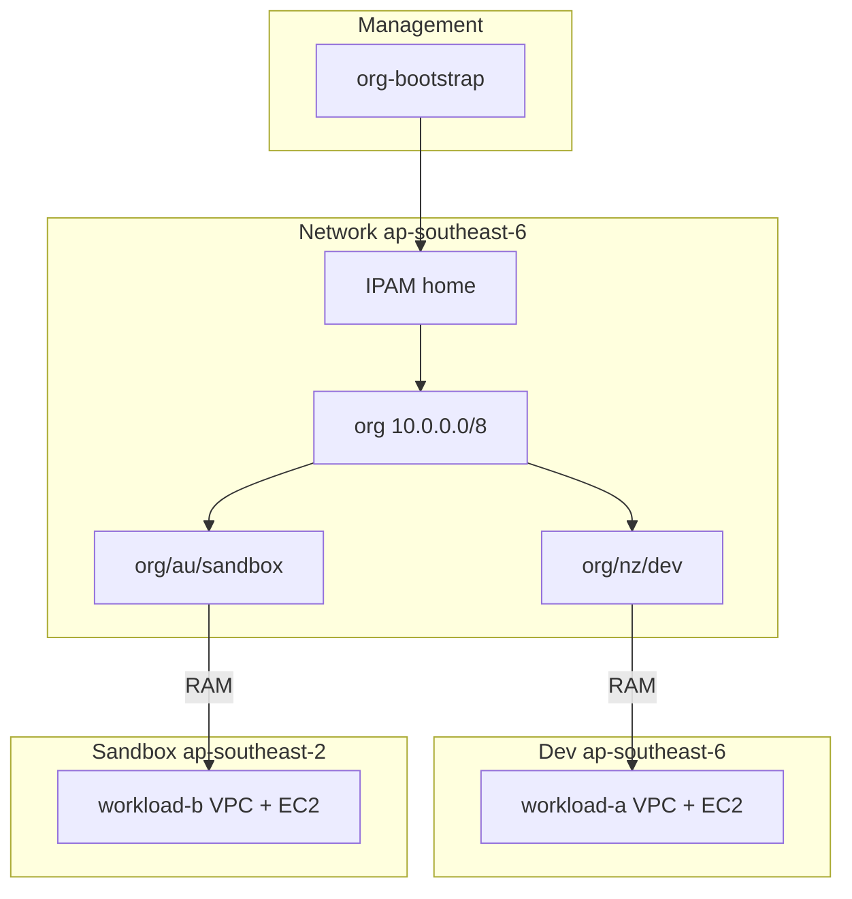

# Design Document

Reference walkthrough: [WALKTHROUGH.md](WALKTHROUGH.md).

## Overview

Four independent Terraform roots model ANZ multi-region IPAM:

| Stack | Account | Region | Purpose |
| --- | --- | --- | --- |
| `org-bootstrap/` | Management | — | Delegate IPAM admin; RAM org sharing |
| `ipam/` | Network | ap-southeast-6 (home) | IPAM + regional pools + RAM shares |
| `workload-a/` | Dev | ap-southeast-6 | VPC /20 + demo EC2 |
| `workload-b/` | Sandbox | ap-southeast-2 | VPC /20 + demo EC2 |

## Design Decisions

| Decision | Choice | Rationale |
| --- | --- | --- |
| Four Terraform roots | Independent roots per account | Real credential boundaries |
| Network account IPAM admin | Delegated member | Management cannot host IPAM |
| IPAM home region | ap-southeast-6 | NZ-primary workloads |
| Pool hierarchy depth | 3 levels (org → region → account) | Regional aggregation + RAM at leaf |
| Root pool locale | None on `org` | Parent locale locks all children; regional locales on `org/nz` and `org/au` |
| IPAM scope | Private only | AWS creates both scopes; RFC1918 VPC pools use Private; Public stays empty |
| RAM vs allocation | RAM = pool access; allocation = usage in IPAM | Share via `ram_share_principals`; visibility via VPC pool allocation |
| Stack contract | Manual tfvars copy | No remote-state coupling |
| NAT gateway | Disabled | Demo cost |
| Demo EC2 | t3.nano, subnet `/32` reservation + `private_ip` | `.5` visible via IPAM Resources → ENIs |
| Org resource monitoring | Enabled by org-bootstrap delegation | Central ENI/host IP visibility across accounts |

## Architecture



## Directory Layout

```text
examples/multi-account/
├── README.md
├── FINDINGS.md
├── .gitignore
├── org-bootstrap/
├── ipam/
├── modules/
│   └── ipam-vpc/
├── workload-a/
└── workload-b/
```

## Component: org-bootstrap

```hcl
resource "aws_vpc_ipam_organization_admin_account" "ipam_admin" {
  delegated_admin_account_id = var.ipam_admin_account_id
}

resource "aws_ram_sharing_with_organization" "this" {}

resource "time_sleep" "wait_for_ram_org_sharing" {
  create_duration = var.ram_sharing_enable_wait_duration
  depends_on      = [aws_ram_sharing_with_organization.this]
}
```

## Component: ipam pools

See [`examples/multi-account/ipam/main.tf`](../../../examples/multi-account/ipam/main.tf).

Variables: `primary_region`, `secondary_region`, `workload_account_a_id`, `workload_account_b_id`.

Outputs: `nz_dev_pool_id`, `au_sandbox_pool_id`, `operating_regions`, `ram_share_pool_keys`.

`ram_share_principals` on leaf pools creates RAM shares (`modules/pool/main.tf`) — workload accounts gain **permission to use** the pool. Workload stacks create VPCs with **`ipv4_ipam_pool_id`** via `modules/ipam-vpc/` for formal pool allocations and **Managed** status in the network IPAM console. See [WALKTHROUGH.md](WALKTHROUGH.md#workload-onboarding-and-ipam-visibility).

## Component: workload stacks

- VPC: `modules/ipam-vpc/` — `ipv4_ipam_pool_id` + `ipv4_netmask_length = 20`
- EC2: `t3.nano`, `aws_ec2_subnet_cidr_reservation` (`explicit`, `/32`) then `private_ip = cidrhost(first_public_subnet, 5)`
- Subnets: `cidrsubnet(aws_vpc.cidr_block, 4, index)` — derived at apply from pool-allocated VPC CIDR

## CIDR Plan

| Path | CIDR | Locale |
| --- | --- | --- |
| `org` | 10.0.0.0/8 | — (global container) |
| `org/nz` | 10.64.0.0/12 | ap-southeast-6 |
| `org/nz/dev` | 10.64.0.0/16 | ap-southeast-6 |
| `org/au` | 10.128.0.0/12 | ap-southeast-2 |
| `org/au/sandbox` | 10.128.0.0/16 | ap-southeast-2 |
| VPC workload-a | 10.64.0.0/20 | ap-southeast-6 |
| VPC workload-b | 10.128.0.0/20 | ap-southeast-2 |
| EC2 demo | .5 in first public /24 | per workload | IPAM Monitoring → Resources → ENIs |

## Stack Contract

| IPAM output | Workload input | Region |
| --- | --- | --- |
| `nz_dev_pool_id` | `pool_id` (workload-a) | ap-southeast-6 |
| `au_sandbox_pool_id` | `pool_id` (workload-b) | ap-southeast-2 |

## Error Handling

| Scenario | Handling |
| --- | --- |
| RAM org sharing from member account | `AccessDeniedException from AWSOrganizations` — use org-bootstrap |
| Child pool locale differs from parent | `InvalidParameterCombination` — omit locale on root pool; set locale on regional children only |
| Wrong pool locale for VPC region | IPAM allocation fails — pool locale must match provider region |
| Wrong credentials | Provider auth failure — verify profile per README |
| Missing pool_id in tfvars | Terraform prompts for variable — copy from ipam outputs |

## Testing Strategy

Static validation only (no live multi-account tests in example):

- `terraform fmt -check` on all four stacks and `modules/ipam-vpc/`
- `terraform validate` after `terraform init` on each root and the shared module
- File-content checks: no IPAM resources in workload stacks; no remote state; no real account IDs in committed docs
