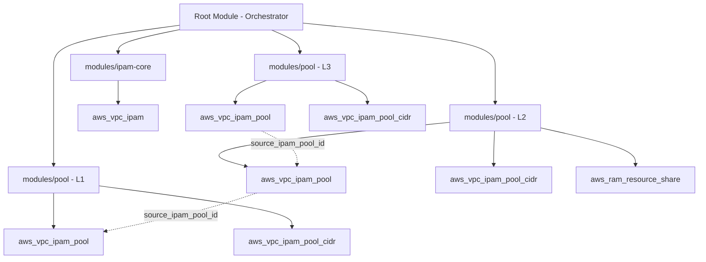
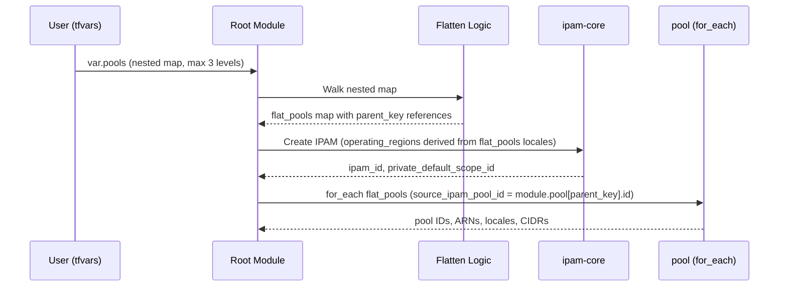
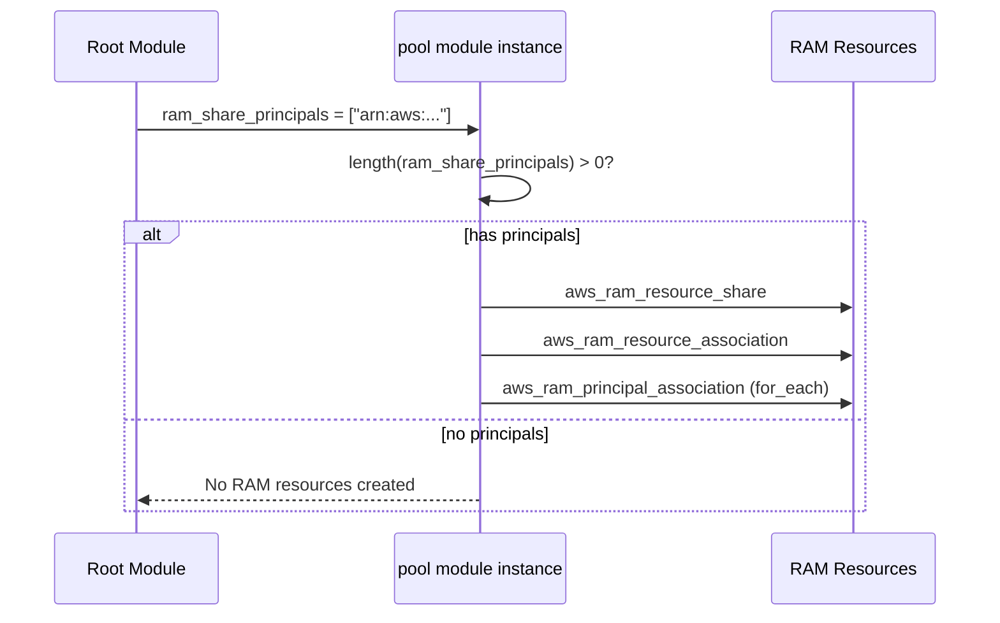

# Design Document: terraform-aws-ipam

## Overview

This module provides a Terraform-native abstraction for AWS VPC IPAM (IP Address Manager). It creates an IPAM instance with hierarchical IPv4 pools (up to 3 levels deep), provisions pool CIDRs, and optionally shares pools via AWS RAM. The module follows tfstack conventions: the root module is an orchestrator only (no direct AWS resources), delegating to two submodules — `ipam-core` (IPAM instance) and `pool` (pool node with CIDR and optional RAM share).

The design borrows pool logic from `aws-ia/terraform-aws-ipam` and follows the repository pattern established in `tfstack/terraform-aws-managed-prometheus`. A single `pools` variable accepts a nested map (max depth 3) which is flattened into a for_each-friendly structure with parent references for hierarchical pool chaining.

## Architecture



## Sequence Diagrams

### Pool Flattening and Instantiation



### RAM Share Conditional Creation



## Components and Interfaces

### Component 1: Root Module (Orchestrator)

**Purpose**: Accepts user configuration, flattens nested pool hierarchy, and orchestrates submodule calls. Contains no AWS resources directly.

**Responsibilities**:
- Flatten nested `var.pools` map into a flat map with `parent_key` references
- Derive `operating_regions` from pool locales + current region
- Resolve scope ID (from new IPAM or existing)
- Pass-through configuration to submodules

### Component 2: modules/ipam-core

**Purpose**: Creates the IPAM instance and configures operating regions.

**Interface**:
```hcl
# Inputs
variable "create" {
  type    = bool
  default = true
}

variable "operating_regions" {
  type = list(string)
}

variable "description" {
  type    = string
  default = null
}

variable "tags" {
  type    = map(string)
  default = {}
}

# Outputs
output "id" {}
output "arn" {}
output "private_default_scope_id" {}
output "public_default_scope_id" {}
```

**Responsibilities**:
- Create `aws_vpc_ipam.this` controlled by `create` variable
- Configure dynamic `operating_regions` blocks
- Expose scope IDs for downstream pool creation

### Component 3: modules/pool

**Purpose**: Creates a single pool node — pool resource, CIDR provisioning, and optional RAM sharing.

**Interface**:
```hcl
# Inputs
variable "create" {
  type    = bool
  default = true
}

variable "address_family" {
  type    = string
  default = "ipv4"
}

variable "ipam_scope_id" {
  type = string
}

variable "source_ipam_pool_id" {
  type    = string
  default = null
}

variable "key" {
  type = string
}

variable "cidr" {
  type = list(string)
}

variable "locale" {
  type    = string
  default = null
}

variable "implied_locale" {
  type    = string
  default = null
}

variable "description" {
  type    = string
  default = null
}

variable "allocation_default_netmask_length" {
  type    = number
  default = null
}

variable "allocation_min_netmask_length" {
  type    = number
  default = null
}

variable "allocation_max_netmask_length" {
  type    = number
  default = null
}

variable "allocation_resource_tags" {
  type    = map(string)
  default = null
}

variable "auto_import" {
  type    = bool
  default = null
}

variable "ram_share_principals" {
  type    = list(string)
  default = []
}

variable "ram_permission_arn" {
  type    = string
  default = "arn:aws:ram::aws:permission/AWSRAMDefaultPermissionsIpamPool"
}

variable "tags" {
  type    = map(string)
  default = {}
}

# Outputs
output "id" {}
output "arn" {}
output "locale" {}
output "cidr" {}
```

**Responsibilities**:
- Create `aws_vpc_ipam_pool.this` with parent chaining via `source_ipam_pool_id`
- Provision CIDRs via `aws_vpc_ipam_pool_cidr.this` (for_each over `var.cidr`)
- Conditionally create RAM share when `length(ram_share_principals) > 0`
- RAM share name: replace `/` with `-` in key/description

## Data Models

### Pool Nested Variable Schema

```hcl
variable "pools" {
  description = "Nested pool definitions. Max depth 3."
  type = map(object({
    cidr                              = list(string)
    locale                            = optional(string)
    description                       = optional(string)
    allocation_default_netmask_length = optional(number)
    allocation_min_netmask_length     = optional(number)
    allocation_max_netmask_length     = optional(number)
    allocation_resource_tags          = optional(map(string))
    auto_import                       = optional(bool)
    ram_share_principals              = optional(list(string))
    sub_pools = optional(map(object({
      cidr                              = list(string)
      locale                            = optional(string)
      description                       = optional(string)
      allocation_default_netmask_length = optional(number)
      allocation_min_netmask_length     = optional(number)
      allocation_max_netmask_length     = optional(number)
      ram_share_principals              = optional(list(string))
      sub_pools = optional(map(object({
        cidr                              = list(string)
        locale                            = optional(string)
        description                       = optional(string)
        allocation_default_netmask_length = optional(number)
        ram_share_principals              = optional(list(string))
      })))
    })))
  }))
  default = {}
}
```

**Validation Rules**:
- Max depth is 3 (enforced by type structure)
- `cidr` must be a valid list of CIDR notations
- `locale` must be a valid AWS region when specified
- `allocation_min_netmask_length` <= `allocation_max_netmask_length` when both set

### Flattened Pool Structure (internal)

```hcl
# Result of flatten logic — flat map keyed by path
# e.g. "workload" (L1), "workload/us-east-1" (L2), "workload/us-east-1/prod" (L3)
locals {
  flat_pools = {
    "workload" = {
      cidr                              = ["10.0.0.0/8"]
      locale                            = null
      implied_locale                    = null
      description                       = "Workload pool"
      allocation_default_netmask_length = 16
      allocation_min_netmask_length     = null
      allocation_max_netmask_length     = null
      allocation_resource_tags          = null
      auto_import                       = null
      ram_share_principals              = []
      parent_key                        = null  # L1 = root pool
    }
    "workload/us-east-1" = {
      cidr       = ["10.1.0.0/16"]
      locale     = "us-east-1"
      parent_key = "workload"  # references L1
      # ...
    }
    "workload/us-east-1/prod" = {
      cidr       = ["10.1.0.0/20"]
      locale     = "us-east-1"
      parent_key = "workload/us-east-1"  # references L2
      # ...
    }
  }
}
```

### Flatten Algorithm

```hcl
locals {
  # Level 1 pools
  l1_pools = {
    for k, v in var.pools : k => merge(v, {
      parent_key     = null
      implied_locale = v.locale
    })
  }

  # Level 2 pools (sub_pools of L1)
  l2_pools = merge([
    for k1, v1 in var.pools : {
      for k2, v2 in coalesce(v1.sub_pools, {}) : "${k1}/${k2}" => merge(v2, {
        parent_key     = k1
        implied_locale = coalesce(v2.locale, v1.locale)
      })
    }
  ]...)

  # Level 3 pools (sub_pools of L2)
  l3_pools = merge([
    for k1, v1 in var.pools : merge([
      for k2, v2 in coalesce(v1.sub_pools, {}) : {
        for k3, v3 in coalesce(v2.sub_pools, {}) : "${k1}/${k2}/${k3}" => merge(v3, {
          parent_key     = "${k1}/${k2}"
          implied_locale = coalesce(v3.locale, v2.locale, v1.locale)
        })
      }
    ]...)
  ]...)

  flat_pools = merge(local.l1_pools, local.l2_pools, local.l3_pools)
}
```

## Key Functions with Formal Specifications

### Function 1: Pool Flattening (locals)

```hcl
# Transforms nested pools map → flat map with parent_key references
locals {
  flat_pools = merge(local.l1_pools, local.l2_pools, local.l3_pools)
}
```

**Preconditions:**
- `var.pools` is a valid map conforming to the nested pool schema
- Pool keys contain no `/` characters (used as path separator)
- Max nesting depth is 3

**Postconditions:**
- Every entry in `flat_pools` has a `parent_key` field
- L1 entries have `parent_key = null`
- L2 entries have `parent_key` referencing a valid L1 key
- L3 entries have `parent_key` referencing a valid L2 key
- All pool attributes are preserved during flattening
- `implied_locale` is resolved by coalescing child locale, parent locale, grandparent locale

### Function 2: Operating Regions Derivation

```hcl
locals {
  operating_regions = distinct(concat(
    [data.aws_region.current.name],
    [for k, v in local.flat_pools : v.locale if v.locale != null]
  ))
}
```

**Preconditions:**
- `data.aws_region.current.name` returns a valid AWS region
- `local.flat_pools` is computed

**Postconditions:**
- Result always contains the current (home) region
- Result contains all unique locales from pool definitions
- No duplicate regions in list

### Function 3: Scope ID Resolution

```hcl
locals {
  scope_id = var.create_ipam
    ? (var.scope_type == "private"
      ? module.ipam_core[0].private_default_scope_id
      : module.ipam_core[0].public_default_scope_id)
    : var.ipam_scope_id
}
```

**Preconditions:**
- If `create_ipam = true`: `module.ipam_core[0]` exists and has valid scope IDs
- If `create_ipam = false`: `var.ipam_scope_id` is provided and non-null

**Postconditions:**
- Returns a valid IPAM scope ID string
- Scope type matches `var.scope_type` when creating new IPAM

### Function 4: RAM Conditional Logic (pool module)

```hcl
resource "aws_ram_resource_share" "this" {
  count = var.create && length(var.ram_share_principals) > 0 ? 1 : 0
  name  = replace(var.key, "/", "-")
}
```

**Preconditions:**
- `var.create` is boolean
- `var.ram_share_principals` is a list (possibly empty)
- `var.key` is a non-empty string

**Postconditions:**
- RAM share created only when `create = true` AND `ram_share_principals` is non-empty
- RAM share name has `/` replaced with `-`
- One principal association per entry in `ram_share_principals`

## Example Usage

```hcl
# Basic: Single pool
module "ipam" {
  source = "tfstack/ipam/aws"

  pools = {
    workload = {
      cidr                              = ["10.0.0.0/16"]
      locale                            = "eu-west-1"
      allocation_default_netmask_length = 20
      description                       = "Workload pool"
    }
  }

  tags = { Environment = "production" }
}

# Advanced: Nested pools with RAM sharing
module "ipam" {
  source = "tfstack/ipam/aws"

  pools = {
    core = {
      cidr   = ["10.0.0.0/8"]
      locale = "us-east-1"
      sub_pools = {
        prod = {
          cidr                 = ["10.1.0.0/16"]
          locale               = "us-east-1"
          ram_share_principals = ["arn:aws:organizations::123456789012:ou/o-abc/ou-def"]
          sub_pools = {
            team-a = {
              cidr   = ["10.1.0.0/20"]
              locale = "us-east-1"
            }
          }
        }
        staging = {
          cidr   = ["10.2.0.0/16"]
          locale = "us-west-2"
        }
      }
    }
  }
}

# Attach to existing IPAM
module "ipam" {
  source = "tfstack/ipam/aws"

  create_ipam   = false
  ipam_scope_id = "ipam-scope-0123456789abcdef0"

  pools = {
    workload = {
      cidr = ["10.0.0.0/16"]
    }
  }
}
```

## Error Handling

### Error Scenario 1: create = false

**Condition**: User sets `create = false` at root level
**Response**: No resources are created. All module counts resolve to 0.
**Recovery**: N/A — intentional no-op for conditional module inclusion.

### Error Scenario 2: create_ipam = false without ipam_scope_id

**Condition**: User sets `create_ipam = false` but does not provide `ipam_scope_id`
**Response**: Terraform plan fails with a clear error at the pool module level (null scope ID)
**Recovery**: User must provide `ipam_scope_id` when `create_ipam = false`

### Error Scenario 3: Pool key contains path separator

**Condition**: A pool key in `var.pools` contains `/` character
**Response**: Flattened keys collide or produce ambiguous paths
**Recovery**: Document that pool keys must not contain `/` (reserved for path construction)

### Error Scenario 4: CIDR overlap in hierarchy

**Condition**: Child pool CIDR not within parent pool CIDR range
**Response**: AWS API returns error during apply (IPAM validates CIDR containment)
**Recovery**: User corrects CIDR ranges to ensure hierarchical containment

## Testing Strategy

### Unit Testing Approach (terraform test)

Use `tests/ipam.tftest.hcl` with mock providers:

| Test case | Assertion |
|-----------|-----------|
| `create = false` | 0 resources planned |
| Single pool | 1 `aws_vpc_ipam_pool`, 1 `aws_vpc_ipam_pool_cidr` |
| Nested 2-level pools | Parent `source_ipam_pool_id = null`, child references parent |
| `ram_share_principals` set | RAM resources planned |
| Outputs | `pool_ids["workload"]` present |

### Integration Testing

Not in scope for v1. Integration tests would require real AWS account with IPAM permissions.

## Performance Considerations

- Pool flattening is O(n) where n = total pools across all levels (max ~100s in practice)
- `for_each` on flat map ensures Terraform processes pools in dependency order via `source_ipam_pool_id`
- IPAM pool creation is rate-limited by AWS API; hierarchical creation benefits from `depends_on` ensuring parent pools exist first

## Security Considerations

- RAM share principals must be validated externally (module does not validate ARN format)
- IPAM pools with RAM shares expose address space to other accounts/OUs
- Default RAM permission (`AWSRAMDefaultPermissionsIpamPool`) allows allocation only — not modification
- No sensitive values in outputs (IDs and ARNs are not secrets)

## Dependencies

- Terraform >= 1.3
- AWS provider >= 5.0
- `hashicorp/aws` provider (for `aws_vpc_ipam`, `aws_vpc_ipam_pool`, `aws_ram_*`)
- `cloudbuildlab/vpc/aws` ~> 1.0 (example only, not a module dependency)

## Correctness Properties

*A property is a characteristic or behavior that should hold true across all valid executions of a system — essentially, a formal statement about what the system should do. Properties serve as the bridge between human-readable specifications and machine-verifiable correctness guarantees.*

### Property 1: Flatten preserves all pools

*For any* valid nested pools input, the flattened output must contain exactly the same number of pool definitions as exist in the input across all levels.

**Validates: Requirements 2.6**

### Property 2: Flatten preserves attributes

*For any* valid nested pools input, every pool attribute (cidr, locale, description, allocation parameters, ram_share_principals) in the original nested structure must appear unchanged in the corresponding entry of the flattened output.

**Validates: Requirements 2.2**

### Property 3: Parent-key integrity

*For any* flattened pool map, every non-null `parent_key` must reference an existing key in the same flat map, and that referenced key must be exactly one level above in the hierarchy. Level-1 pools must have `parent_key = null`.

**Validates: Requirements 2.3, 2.4, 2.5**

### Property 4: Implied locale coalescing

*For any* child pool that does not specify a locale, the `implied_locale` must equal the nearest ancestor's locale (parent first, then grandparent).

**Validates: Requirements 2.7**

### Property 5: Operating regions superset

*For any* set of pool definitions, the derived `operating_regions` list must contain the current AWS region AND all unique non-null locale values from the pools, with no duplicates.

**Validates: Requirements 1.2, 5.1, 5.2, 5.3**

### Property 6: RAM conditional creation

*For any* pool configuration, RAM resources are created if and only if `create = true` AND `ram_share_principals` is a non-empty list.

**Validates: Requirements 4.1, 4.4**

### Property 7: RAM share name sanitization

*For any* pool key containing `/` characters, the resulting RAM share name must have all `/` replaced with `-`.

**Validates: Requirements 4.5**

### Property 8: Create=false produces no resources

*For any* module invocation with `create = false`, zero AWS resources shall be planned or created.

**Validates: Requirements 1.4**

### Property 9: Scope resolution correctness

*For any* module invocation, when `create_ipam = true` the scope ID must come from the created IPAM instance matching the requested `scope_type`, and when `create_ipam = false` the scope ID must equal the user-provided `ipam_scope_id`.

**Validates: Requirements 6.1, 6.2, 6.3**

**Validates: Requirements 6.1, 6.2, 6.3**
